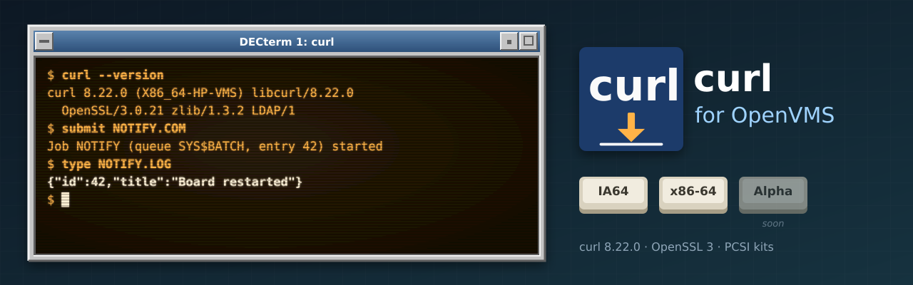

<p align="center">
  
</p>

# curl for OpenVMS

[curl](https://curl.se) (**8.22.0**) built natively for OpenVMS on **IA64** and **x86-64**,
following curl's own releases rather than any vendor's release cycle. VSI ships a CURL kit,
but it follows VSI's slower release cycle; this port tracks upstream curl in lock-step. It
belongs to the same family as [GNU grep](https://github.com/issinoho/vms-grep),
[PCRE2](https://github.com/issinoho/vms-pcre2), [GNU sed](https://github.com/issinoho/vms-sed),
[GNU awk](https://github.com/issinoho/vms-awk) and [zlib](https://github.com/issinoho/vms-zlib)
for OpenVMS.

curl ships its own OpenVMS build (`projects/vms/build_vms.com`) in the release tarball. This
repository builds with it and holds **only our changes**: every build starts from the signed
release tarball (Daniel Stenberg's key, pinned in `keys/`), applies our patches and adds our
VMS files in `vmsport/`.

- **TLS:** VSI's OpenSSL 3.0 kit (SSL3), linked through its shared images.
- **zlib:** [vms-zlib](https://github.com/issinoho/vms-zlib), linked statically
  (`--compressed`).
- **CA certificates:** the kit ships curl.se's extract of Mozilla's root store and curl
  uses it by default, so HTTPS works without `--cacert`.

## Status

| | IA64 (OpenVMS V8.4-2L3, VSI C 7.4) | x86-64 (OpenVMS E9.2-4, VSI C 7.7) |
|---|---|---|
| Builds with upstream's `build_vms.com` | yes | yes |
| Smoke test (HTTP, HTTPS with the default CA bundle, `--compressed`, batch output, errors) | 8/8 | 8/8 |
| Form post from a batch job | yes | yes |
| PCSI kit ([v8.22.0-vms1](https://github.com/issinoho/vms-curl/releases/tag/v8.22.0-vms1)) | `ISSINOHO-I64VMS-VMSCURL-V0822-0E1-1.PCSI` | `ISSINOHO-X86VMS-VMSCURL-V0822-0E1-1.PCSI` |

`curl --version` on x86-64:

```
curl 8.22.0 (X86_64-HP-VMS) libcurl/8.22.0 OpenSSL/3.0.21 zlib/1.3.2 LDAP/1
Protocols: dict file ftp ftps gopher gophers http https imap imaps ipfs ipns ldap ldaps mqtt mqtts pop3 pop3s rtsp smtp smtps telnet tftp ws wss
Features: alt-svc HSTS HTTPS-proxy HTTPSIG IPv6 Largefile libz SSL
```

There is no HTTP/2, HTTP/3, SSH (scp/sftp) or Kerberos support in this build.

## Installing the kit

The kit needs VSI's **SSL3** kit (OpenSSL 3.0). Download the kit for your architecture from
the [latest release](https://github.com/issinoho/vms-curl/releases/latest) and check it
against the release's `SHA256SUMS`. A kit downloaded through a non-VMS system loses its
record format, so restore that first, then install it:

```
$ SET FILE/ATTRIBUTE=(RFM:FIX,LRL:8192,MRS:8192,RAT:NONE) ISSINOHO-*-VMSCURL-V0822-0E1-1.PCSI
$ PRODUCT INSTALL VMSCURL /PRODUCER=ISSINOHO /SOURCE=dev:[dir]
$ curl :== $VMSCURL$ROOT:[BIN]CURL.EXE
```

It installs `CURL.EXE` under `[VMSCURL.BIN]`, the CA bundle as `[VMSCURL.SSL]CACERT.PEM`,
the documentation in `[VMSCURL.DOC]`, and `SYS$STARTUP:VMSCURL$STARTUP.COM`, which defines
`VMSCURL$ROOT` (add `$ @SYS$STARTUP:VMSCURL$STARTUP.COM` to `SYS$MANAGER:SYSTARTUP_VMS.COM`
to define it at every boot). `PRODUCT REMOVE VMSCURL` removes it and deassigns
`VMSCURL$ROOT`. The kit's version `V8.22-0E1` is curl 8.22.0 with our patch level as the
ECO.

**Alongside VSI's CURL kit:** VSI's kit uses `[CURL]`, `CURL$ROOT` and `CURL$STARTUP.COM`;
this one uses `VMSCURL` names throughout, so both can be installed. The `curl` foreign
command decides which one runs.

**CA certificates:** curl verifies servers against `VMSCURL$ROOT:[SSL]CACERT.PEM` unless
`--cacert` is given or the logical name `CURL_CA_BUNDLE` points at another PEM file. Each
kit brings the bundle current at its release.

## curl in batch jobs: quote upper-case options

Batch jobs run with the **TRADITIONAL** DCL parse style, even when interactive logins are
set to EXTENDED. DCL then upper-cases the unquoted parts of a command and the C run-time
library hands them to curl in lower case, so an unquoted `-F` arrives as `-f` (`--fail`).
A form post that works interactively then fails in batch, usually with
`%CURL-E-URL_MALFORMAT`, because the form field is taken as a second URL. This explains
the long-standing report that "curl fails silently in batch"; VSI's curl behaves the same.
Either quote the options:

```
$ curl "https://notify.example/message" "-F" "title=Board restarted" "-F" "message=Out of resources"
```

or start the procedure with `$ SET PROCESS/PARSE_STYLE=EXTENDED`. When curl fails under
TRADITIONAL, this build names the unquoted options that may have lost their case:

```
curl: note: the process parse style is TRADITIONAL: unquoted options -f reached curl in lower case.
curl: note: to pass -F, quote them ("-F") or SET PROCESS/PARSE_STYLE=EXTENDED first.
```

**Failures you can test for.** curl exits with a VMS condition value (`%CURL-E-<error>`).
Upstream's VMS code, and VSI's curl 8.13 with it, returns every failure with severity 3
(informational) instead of 2 (error), because of a typo in `VMS_STS()`. `ON ERROR` never
fires, and `$SEVERITY` looks like success, so a batch job carries on as if the transfer had
worked. This build fixes that (patch 0011): a failed transfer is an error, so `ON ERROR`
and `IF .NOT. $STATUS` work.

## Patches

| Patch | Purpose |
|---|---|
| 0001 | `build_vms.com`: link VSI's SSL3 kit (`SSL3$LIBSSL_SHR32`, selected from `OPENSSL`) and zlib statically from `ZLIB$ROOT`; write `config_vms.h` into `[.lib]`. |
| 0002 | All VMS procedures: take the architecture from `ARCH_NAME`, not `HW_MODEL`, which put x86-64 in the VAX range. |
| 0003 | `build_vms.com`: generate the configuration from `lib/curl_config.h.in`, not the CMake template the wildcard found. |
| 0004 | `config_h.com`/`generate_config_vms_h_curl.com`: skip configure's feature switches (`USE_*`, `CURL_DISABLE_*`, ...) instead of guessing them; `CURL_OS` and type sizes for x86-64; no GSS-API without its headers; no `fnmatch()` without `<fnmatch.h>`; no `accept4()` or `strerror_r()`. |
| 0005 | `build_vms.com`: compile the `lib` subdirectories (`vtls`, `curlx`, `vauth`, `vdns`, `vquic`, `vssh`) and `src/toolx`; include paths that work with both compilers; `/DEBUG=TRACEBACK` on x86-64, where VSI C 7.7 crashes compiling `formdata.c` with full `/DEBUG`. |
| 0006 | `src/tool_formparse.c`: include `<fabdef.h>` for `FAB$C_VFC`. |
| 0007 | `lib/ldap.c`: free LDAP API info with `ldap_value_free()`; VMS LDAP has no `ber_memvfree()`. |
| 0008 | `src/tool_cb_wrt.c`, `tool_cb_hdr.c`: write output with `putc`, so a body sent to a terminal, batch log or mailbox comes out as lines instead of one character per record. |
| 0009 | `src/tool_vms.c`: when curl fails under the TRADITIONAL parse style, name the unquoted options that lost their case. |
| 0010 | `generate_config_vms_h_curl.com`: compile in a default CA bundle given by the logical name `CURL_CA_BUNDLE_DEFAULT` at build time. |
| 0011 | `src/tool_vms.h`: fix `VMS_STS()` (`<` for `<<`), which set the low bit of every error exit status and made `%CURL-E-` failures severity 3 (informational), so `ON ERROR` and `$SEVERITY` tests saw success. |

Patches 0002-0007 and 0011 fix upstream's VMS support or plain bugs and could go back to curl.

## How to build

The build needs VSI's SSL3 kit and a [vms-zlib](https://github.com/issinoho/vms-zlib)
install tree in the same work directory (`ZLIB_TREE` in `upstream.conf`).

```sh
git clone https://github.com/issinoho/vms-curl.git
cd vms-curl
tools/prepare.sh            # fetch + verify the release and CA bundle, apply patches, add vmsport/
tools/build.sh ia64         # upload, then @[.VMSPORT]BUILD on the node (upstream's build_vms.com)
tools/test.sh ia64          # smoke test (needs network access to example.com)
tools/kit.sh ia64           # PCSI kit -> out/kits/
```

By hand on VMS: copy the top-level files of `staging/curl-8.22.0/` and its `include`, `lib`,
`src`, `projects` and `vmsport` directories, define `ZLIB$ROOT` for the zlib install tree,
then `@[.VMSPORT]BUILD` and `@[.VMSPORT]TEST_SMOKE`. Set up `tools/nodes.conf` as
described in
[vms-grep's README](https://github.com/issinoho/vms-grep#2b-build-on-vms-from-the-host-over-ssh).

## Roadmap

1. HTTP/2 (nghttp2) and SSH (libssh2) support.
2. Patches 0002-0007 and 0011 offered to curl (0011, the exit-severity fix, also affects VSI's curl).
3. A port to OpenVMS **Alpha**.

The family of ports, all for IA64 and x86-64, each following its upstream releases:

| Port | Latest release | |
|---|---|---|
| GNU grep — [vms-grep](https://github.com/issinoho/vms-grep) | [v3.12-vms3](https://github.com/issinoho/vms-grep/releases/tag/v3.12-vms3) | with `grep -P` through PCRE2 |
| PCRE2 — [vms-pcre2](https://github.com/issinoho/vms-pcre2) | [v10.49-vms1](https://github.com/issinoho/vms-pcre2/releases/tag/v10.49-vms1) | the regular-expression library |
| GNU sed — [vms-sed](https://github.com/issinoho/vms-sed) | [v4.10-vms1](https://github.com/issinoho/vms-sed/releases/tag/v4.10-vms1) | the stream editor |
| GNU awk (gawk) — [vms-awk](https://github.com/issinoho/vms-awk) | [v5.4.1-vms1](https://github.com/issinoho/vms-awk/releases/tag/v5.4.1-vms1) | built with gawk's own VMS port |
| zlib — [vms-zlib](https://github.com/issinoho/vms-zlib) | [v1.3.2-vms1](https://github.com/issinoho/vms-zlib/releases/tag/v1.3.2-vms1) | the compression library |
| **curl** (this port) — [vms-curl](https://github.com/issinoho/vms-curl) | [v8.22.0-vms1](https://github.com/issinoho/vms-curl/releases/tag/v8.22.0-vms1) | alongside VSI's curl kit, following curl's own releases |
| GNU Wget — [vms-wget](https://github.com/issinoho/vms-wget) | [v1.25.0-vms2](https://github.com/issinoho/vms-wget/releases/tag/v1.25.0-vms2) | the web retriever |
| GNU m4 — [vms-m4](https://github.com/issinoho/vms-m4) | [v1.4.21-vms1](https://github.com/issinoho/vms-m4/releases/tag/v1.4.21-vms1) | the macro processor |
| GNU Bison — [vms-bison](https://github.com/issinoho/vms-bison) | [v3.8.2-vms2](https://github.com/issinoho/vms-bison/releases/tag/v3.8.2-vms2) | runs GNU m4 |
| flex — [vms-flex](https://github.com/issinoho/vms-flex) | [v2.6.4-vms1](https://github.com/issinoho/vms-flex/releases/tag/v2.6.4-vms1) | the scanner generator; runs GNU m4 |
| GNU make — [vms-make](https://github.com/issinoho/vms-make) | [v4.4.1-vms1](https://github.com/issinoho/vms-make/releases/tag/v4.4.1-vms1) | built with make's own VMS port |

## Artwork

`docs/images/banner.svg` and `docs/images/icon.svg` were made for this project in the style
of classic DECwindows and VT terminals, like those of its sibling ports. The "curl" mark in
them is our own drawing, not curl's official logo.

## Licence

curl is distributed under the curl licence (MIT style); see `COPYING`, a copy of
upstream's. Our patches and VMS build files are distributed under the same terms. The CA
bundle is Mozilla's root store as published by the curl project, under the MPL 2.0.

OpenVMS is a trademark of VMS Software, Inc. This project is not affiliated with VMS
Software, Inc. or with the curl project.
